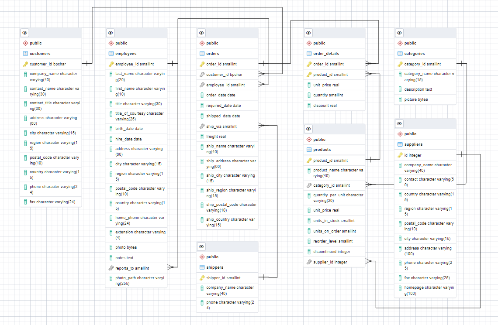

Есть имеющаяся база данных **Northwind Traders**.

БД включает таблицы:
1. Клиенты Northwind Traders, которые покупают у компании товары (таблица *customers*)
2. Информация о товарах, которыми торгует компания (таблица *products*)
3. Группы / категории товаров (таблица *categories*)
4. Сведения о сотрудниках Northwind Traders (таблица *employees*)
5. Сведения о грузоперевозчиках, которые доставляют товары конечным покупателям (таблица *shippers*)
6. Сведения по договорам / заказам (таблица *orders*)
7. Детальная информация по договорам / заказам (таблица *order_details*)

### Задача:

Из json файла, содержащего информацию о поставщиках, извлечь информацию и загрузить ее в таблицу
(*suppliers*). В таблице *products* создать поле и связать его с id поставщика, который поставляет
данный товар. Подготовить SQL- pfghjcs для выборки данных для страниц внутреннего портала.

### Файлы:
1. Дамп итоговой БД - [northtr_backup.sql](northtr_backup.sql)
2. ER-диаграмма итоговой БД - [northtr_db.pgerd](northtr_db.pgerd)
3. sql-скрипты:
 - создания таблицы *suppliers* и поля в *products* - [create_table_column.sql](create_table_column.sql)
 - загрузки данных в *suppliers* - [suppliers.sql](suppliers.sql)
 - добавления id поставщика в *products* - [update_products.sql](update_products.sql)
4. запросы для выборки данных:
 - [customers_page.sql](customers_page.sql)
 - [orders_page.sql](orders_page.sql)
 - [employees_page.sql](employees_page.sql)
 - [products_page.sql](products_page.sql)

